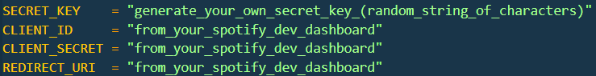
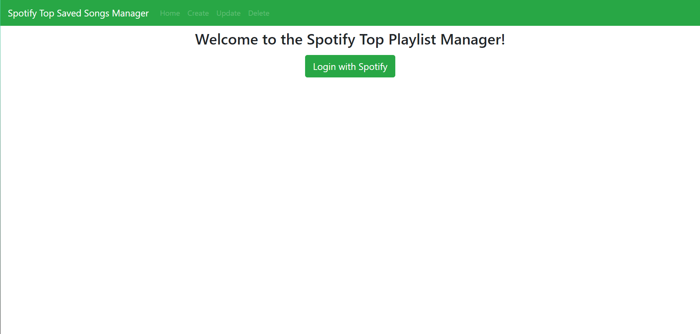
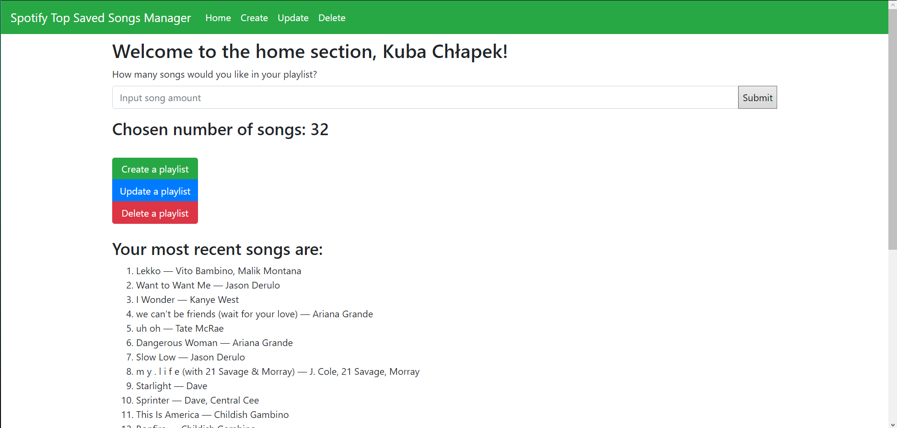
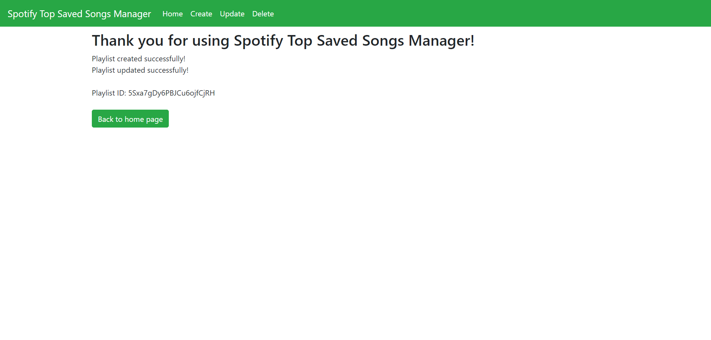
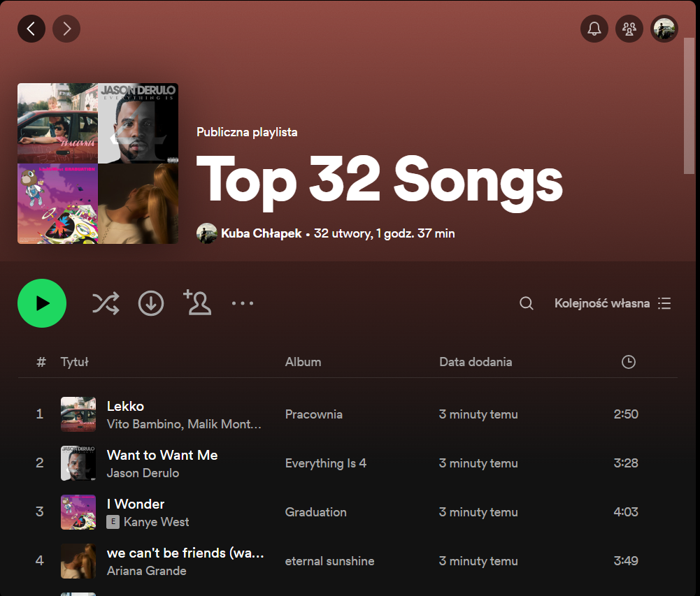

# spotify-top-playlist-creator
 App that creates and updates a new playlist on your Spotify account, consisting of top "X" most recent songs in your "Liked" playlist. I made this app to get familiar with Flask, SQLAlchemy and to get some practice working with APIs. The appearance of the site was done using Bootstrap.

 # USAGE
 1. Clone this repository to local.
 2. Get your client credentials from the Spotify Web Api website and put them in a ".env" file in the same directory as the code. They should be structured as such:

 3. Run main.py and follow the REDIRECT_URI you made earlier.
 4. Login with Spotify and authorize.
 5. Choose how many songs you want in the playlist and submit. From there you can create, update or delete the playlist.

 # EXAMPLES
 Login Page.

 Home Page with chosen songs (do not judge).

 Create Page

 Result Playlist

